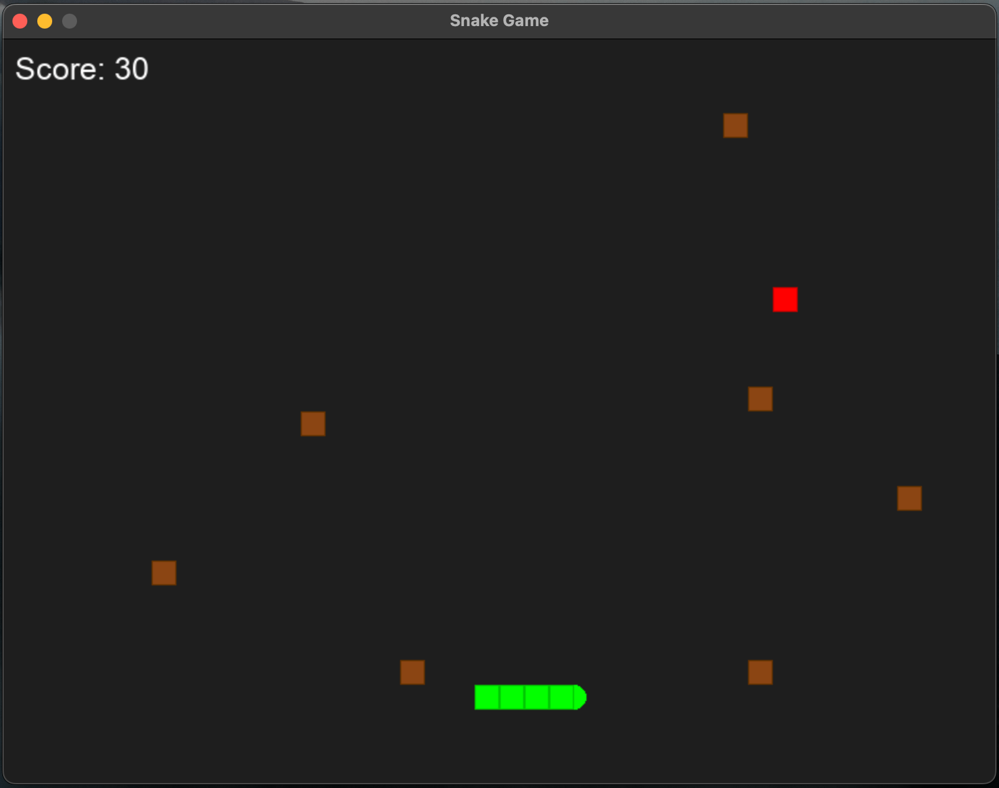

# Python Snake Game

A modern implementation of the classic Snake game using Python and Pygame.



## Features

- Classic snake gameplay with modern graphics
- Rounded snake head for improved aesthetics
- Obstacles for added challenge
- Score tracking
- Game over and restart functionality
- Configurable game speed and grid size

## Requirements

- Python 3.6+
- Pygame 2.5.2

## Installation

1. Clone this repository:

```
git clone https://github.com/your-username/snake-game.git
cd snake-game
```

2. Install the required dependencies:

```
pip install -r requirements.txt
```

## How to Play

Run the game:

```
python src/main.py
```

### Controls:

- Arrow keys: Move the snake
- Esc: Quit the game
- Enter: Restart after game over

## Game Rules

- Guide the snake to eat the red food
- Each food item increases your score by 10 points
- The snake grows longer with each food item eaten
- Game ends if the snake collides with itself or with obstacles
- The snake can pass through walls and appear on the opposite side

## Project Structure

```
snake-game/
├── src/
│   ├── main.py         # Game entry point
│   ├── game.py         # Game class with main game logic
│   ├── snake.py        # Snake class and behaviors
│   ├── food.py         # Food class
│   ├── obstacle.py     # Obstacle class
│   └── constants.py    # Game constants and settings
├── assets/
│   └── sounds/         # Game sound effects (if added)
├── requirements.txt    # Python dependencies
└── README.md           # This file
```

## Development

Feel free to fork this project and make your own modifications. Some ideas for enhancements:

- Add sound effects
- Add different types of food with special effects
- Implement levels with increasing difficulty
- Add a high score system

## License

This project is licensed under the MIT License - see the LICENSE file for details.
